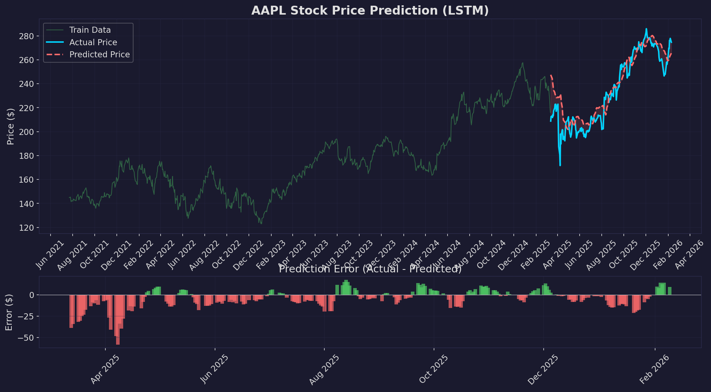
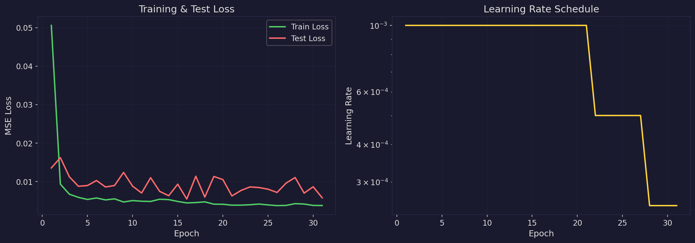
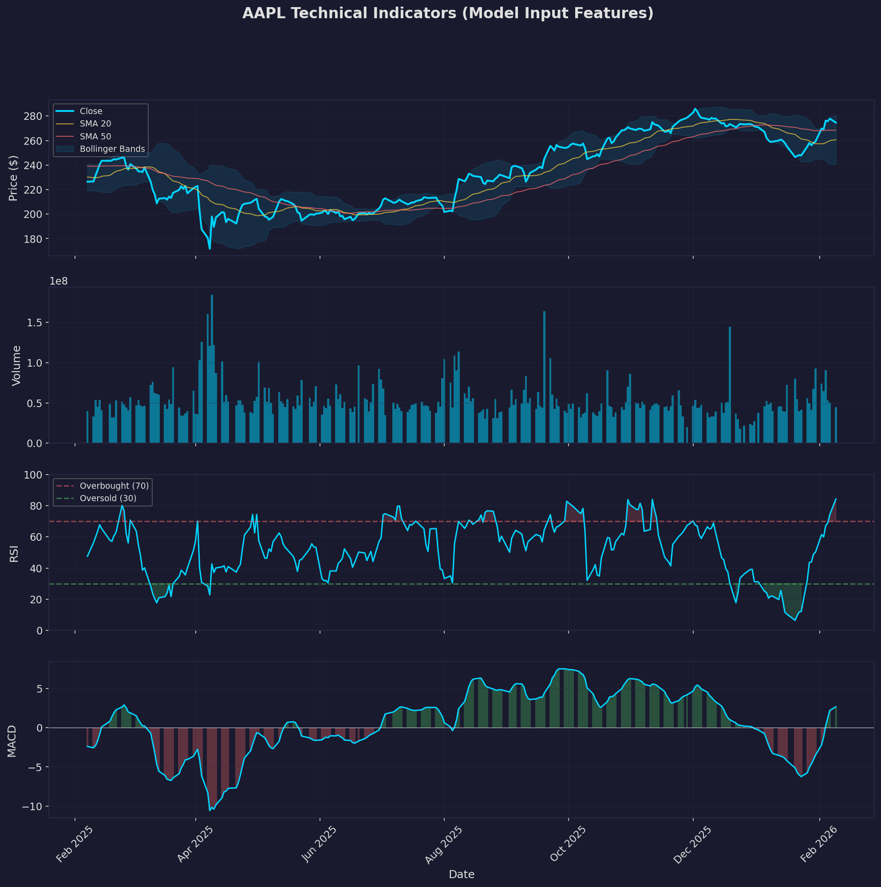
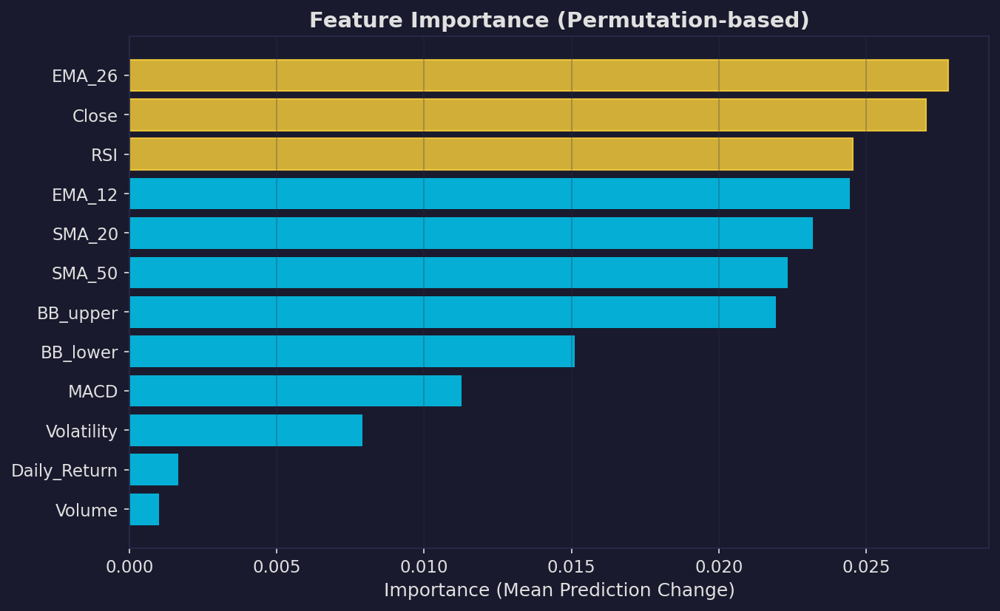

# Stock Price Predictor

An LSTM neural network that predicts stock prices using technical indicators. Fetches real market data from Yahoo Finance, engineers 12 features, and forecasts prices 5 days ahead. Includes a Gradio web UI for interactive predictions.

> **Disclaimer:** This is an educational project for learning ML concepts. Do NOT use for real trading decisions.

## Results (AAPL - Apple Inc.)

### Prediction vs Actual Price


The model tracks the general trend well, with an average error of ~4% of the stock price. The shaded area shows the gap between predicted and actual values.

| Metric | Value |
|--------|-------|
| MAE (Mean Absolute Error) | $9.19 |
| RMSE (Root Mean Squared Error) | $12.34 |
| MAPE (Mean Absolute % Error) | 4.16% |
| Direction Accuracy | 44.7% |
| Test Period | ~229 trading days |
| Training Time | 31 epochs (early stopped) |

### Training History


Left: Train/Test loss both decrease, then test loss plateaus (early stopping prevents overfitting). Right: Learning rate automatically reduces when the model stops improving.

### Technical Indicators (Model Input)


These are the features the model sees. From top to bottom:
- **Price + Moving Averages + Bollinger Bands** - Trend and volatility channels
- **Volume** - Trading activity (conviction behind price moves)
- **RSI** - Momentum indicator (overbought >70, oversold <30)
- **MACD** - Trend momentum (green = bullish, red = bearish)

### Feature Importance


Which features matter most? This is measured by shuffling each feature and seeing how much predictions change. The top features (yellow) have the most influence.

## How It Works

```
Historical Data (Yahoo Finance)
     |
[Feature Engineering] - Calculate 12 technical indicators
     |
     v
[60-day sliding windows] - Each sample = 60 days x 12 features
     |
     v
[LSTM Layer 1] - Learn basic temporal patterns
     |
[LSTM Layer 2] - Learn higher-level patterns
     |
[Dense Layers] - Map to price prediction
     |
     v
Predicted Price (5 days ahead)
```

### What is an LSTM?

LSTM (Long Short-Term Memory) is a neural network designed for sequential data. Unlike regular networks, it processes data step-by-step and maintains a "memory" of what it has seen.

**The 3 Gates:**
1. **Forget Gate** - "What old info should I discard?" (that spike 50 days ago isn't relevant)
2. **Input Gate** - "What new info should I remember?" (RSI just hit oversold!)
3. **Output Gate** - "What should I predict now?" (based on everything seen)

### Technical Indicators Used

| Feature | What It Measures | Why It Matters |
|---------|-----------------|----------------|
| Close | Current price | The target variable |
| Volume | Shares traded | Conviction behind moves |
| SMA_20 | 20-day average | Short-term trend |
| SMA_50 | 50-day average | Medium-term trend |
| EMA_12 | 12-day exp. average | Fast trend (reacts quickly) |
| EMA_26 | 26-day exp. average | Slow trend |
| RSI | Relative Strength | Overbought/oversold |
| MACD | Trend momentum | Bull/bear momentum |
| BB_upper | Bollinger upper | Statistical high extreme |
| BB_lower | Bollinger lower | Statistical low extreme |
| Daily_Return | % change | Daily movement |
| Volatility | Rolling std dev | Price uncertainty |

## Setup

```bash
git clone git@github.com:H4ph4z4rdz/stock-predictor.git
cd stock-predictor

python -m venv venv
venv\Scripts\activate

pip install -r requirements.txt
```

## Usage

### Train the Model
```bash
python src/train.py                    # Default: AAPL, 5 years
python src/train.py --ticker NVDA      # Train on NVIDIA
python src/train.py --ticker MSFT --epochs 200
```

### Launch the Web UI
```bash
python src/app.py
```
Open **http://localhost:7863** in your browser.

## Project Structure

```
stock-predictor/
├── assets/                    # Charts for README
├── configs/
│   └── default.yaml           # All configuration
├── models/                    # Saved model weights (auto-generated)
├── plots/                     # Generated visualization charts
└── src/
    ├── train.py               # Training script
    ├── app.py                 # Gradio web UI
    └── core/
        ├── data.py            # Yahoo Finance + feature engineering
        ├── model.py           # LSTM architecture
        ├── trainer.py         # Training loop with early stopping
        └── visualize.py       # Chart generation
```

## Why Direction Accuracy is ~50%

The direction accuracy (~44.7%) being close to random (50%) is actually expected and important to understand:

1. **Efficient Market Hypothesis** - Stock prices already reflect all available information. Publicly available indicators (SMA, RSI, etc.) are priced in.
2. **The model learns price levels well** (4% MAPE) but **not direction** - this is the difference between "where will the price be?" vs "will it go up or down?"
3. **This is why quantitative trading is hard** - even billion-dollar hedge funds struggle to consistently beat 55% directional accuracy.

The educational value is in understanding the pipeline, not in making money.

## Tech Stack

- **PyTorch** - Deep learning framework
- **yfinance** - Yahoo Finance market data API
- **matplotlib** - Visualization
- **scikit-learn** - Data preprocessing (MinMaxScaler)
- **Gradio** - Web UI

## License

MIT
